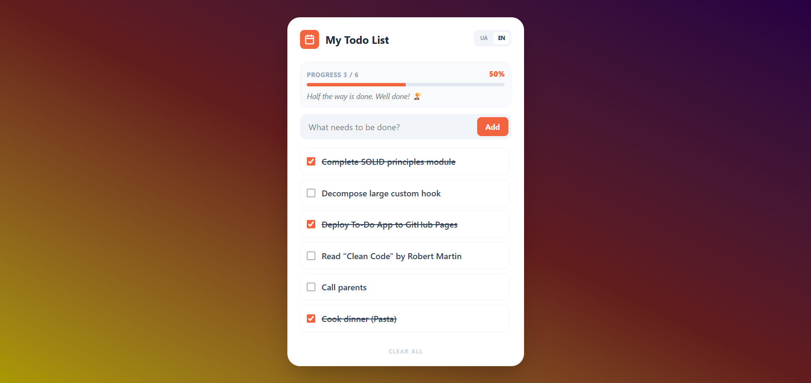

# My-ToDo App




A streamlined task manager designed for daily productivity. Built with a focus on performance, clean UI, and persistent client-side storage.

## Live Demo
👉 **[Open My-ToDo App](https://dzaidun.github.io/My-ToDo/)**

## Key Features
- **Task Management:** Seamlessly add, edit, and remove daily tasks.
- **Visual Feedback:** Interactive UI with strikethrough styles for completed items.
- **Progress Tracking:** Real-time progress bar displaying completion percentage.
- **Motivation System:** Dynamic quotes that adapt based on your productivity level.
- **Data Persistence:** Autosaves to LocalStorage — your tasks remain safe after page reloads.
- **Responsive Design:** Optimized layout for both mobile devices and desktops.
- **Localization:** Built-in support for English and Ukrainian languages.

## Tech Stack
- **React** — Built with Functional Components and Custom Hooks.
- **TypeScript** — Ensures type safety and improves maintainability.
- **Vite** — Next-generation frontend tooling for instant HMR.
- **Tailwind CSS** — Utility-first framework for rapid and modern styling.
- **GitHub Pages** — Automated deployment and hosting.

## Local Setup
To run the project locally, follow these steps:

```bash
# Clone the repository
git clone https://github.com/dzaidun/My-ToDo.git

# Navigate to the project directory
cd My-ToDo

# Install dependencies
npm install

# Start the development server
npm run dev
```

The app will be available at `http://localhost:5173`.

## Author
**Denys Zaidun**
- GitHub: [dzaidun](https://github.com/dzaidun)